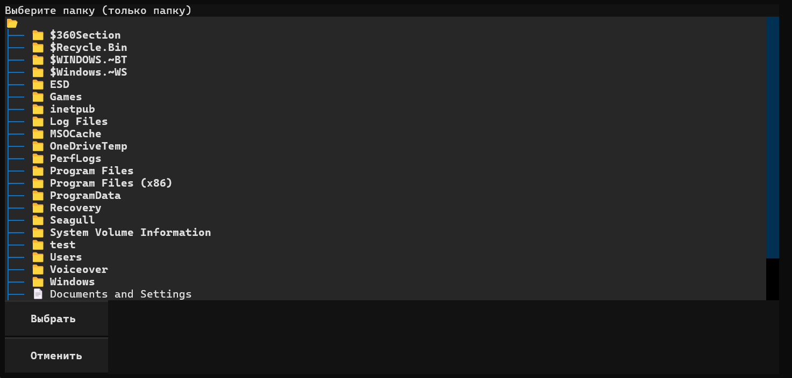
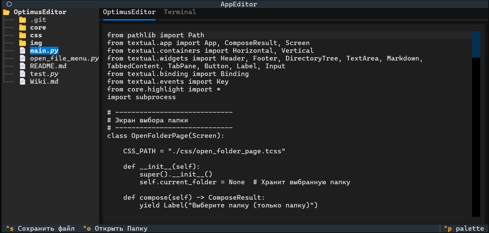
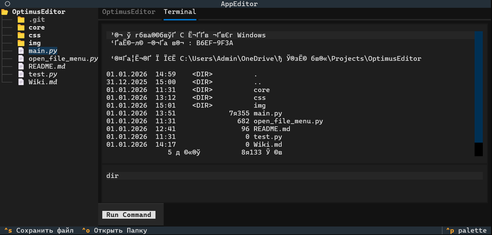

# Optimus Editor Wiki

## Главная страница

 - Краткое описание проекта: что это, для чего и на чем написан.

 - Ссылка на релиз v1.0.0.

 - Основные вкладки: Редактор и Терминал.

## 1️⃣ О проекте

Optimus Editor — лёгкий текстовый редактор кода на Python с интерфейсом Textual.

Проект создан для:

1) практики работы с Python GUI;

2) редактирования файлов прямо в редакторе;

3) запуска команд в встроенном терминале.

Основные функции:

 - Открытие папок и файлов: через встроенный проводник, выбирается папка, отображается содержимое.

 - Редактирование файлов: изменения можно делать прямо в текстовом поле редактора.

 - Встроенный терминал: ввод команд и получение многострочного вывода прямо в интерфейсе.

 - Сохранение файлов: кнопка и горячие клавиши для сохранения с уведомлением.

## 2️⃣ Руководство пользователя
Запуск редактора

1) Убедитесь, что установлен Python 3.10+, вместе с Textual 2.1.1
    <details><summary>Как Устнаовить Python и Textual</summary> 

    ### Windows
    
    Установка Python на Windows
    
    #### 1️⃣ Проверка установленной версии

    Открой PowerShell или Командную строку (CMD) и введи:
    ```powershell
    python --version
    ```

    Если выводит версию Python (например Python 3.11.6), значит Python уже установлен.

    Если нет, продолжаем установку.

    #### 2️⃣ Скачивание Python

    Перейди на официальный сайт: https://www.python.org/downloads/

    Нажми Download Python 3.x.x (последняя стабильная версия).

    Сохрани установщик на компьютер.

    #### 3️⃣ Установка Python

    Запусти скачанный установщик.

    Очень важно: поставь галочку Add Python to PATH внизу окна.

    Нажми Install Now.

    Дождись завершения установки.

    #### 4️⃣ Проверка установки

    Открой PowerShell или CMD и введи:
    ```powershell
    python --version
    ```

    Если всё правильно, увидишь версию Python.

    Также можно проверить менеджер пакетов pip:
    ```powershell
    pip --version
    ```

    #### 5️⃣ Создание виртуального окружения (рекомендовано для проектов)

    В терминале перейди в папку проекта:
    ```
    cd C:\path\to\project
    ```

    Создай виртуальное окружение:
    ```powershell
    python -m venv venv
    ```

    Активируй его:
    ```powershell
    # PowerShell
    .\venv\Scripts\Activate.ps1

    # CMD
    .\venv\Scripts\activate.bat
    ```

    После активации можно устанавливать библиотеки только для этого проекта:
    ```powershell
    pip install textual
    ```

    Чтобы выйти из виртуального окружения:
    ```powershell
    deactivate
    ```

    ### Linux

    Python обычно уже установлен в большинстве дистрибутивов Linux, но иногда нужна более новая версия.

    #### 1️⃣ Проверка установленной версии

    Открой терминал и введи:

    ```sh
    python3 --version
    ```

    Если выводит версию (например Python 3.10.12), Python уже установлен.

    Если нет — нужно установить.

    #### 2️⃣ Установка через пакетный менеджер
    Для Debian / Ubuntu / Linux Mint
    ```sh
    sudo apt update
    sudo apt install python3 python3-pip -y
    ```

     - python3 — сам интерпретатор Python.

     - python3-pip — менеджер пакетов Python (для установки библиотек).

    Проверка:
    ```sh
    python3 --version
    pip3 --version
    ```
    
    Для Fedora / RedHat / CentOS
    ```sh
    sudo dnf install python3 python3-pip -y
    ```

    Для Arch Linux / Manjaro
    ```sh
    sudo pacman -Syu python python-pip
    ```

    #### 3️⃣ Установка через Pyenv (для нескольких версий Python)

    Если нужен контроль над версиями Python или последняя версия, можно использовать `pyenv`.

    Установка зависимостей:

    # для Debian/Ubuntu
    ```sh
    sudo apt update && sudo apt install -y make build-essential libssl-dev zlib1g-dev \
    libbz2-dev libreadline-dev libsqlite3-dev wget curl llvm libncurses5-dev libncursesw5-dev \
    xz-utils tk-dev libffi-dev liblzma-dev python-openssl git
    ```


    Установка pyenv:
    ```
    curl https://pyenv.run | bash
    ```

    Добавить в ~/.bashrc или ~/.zshrc:
    ```
    export PATH="$HOME/.pyenv/bin:$PATH"
    eval "$(pyenv init --path)"
    eval "$(pyenv virtualenv-init -)"
    ```

    Установить Python через pyenv:
    ```
    pyenv install 3.11.6
    pyenv global 3.11.6
    ```

    Проверка:
    ```
    python --version
    ```

    #### 4️⃣ Проверка работы Python

    В терминале введи:
    ```
    python3
    python # Если python3 не сработал
    ```

    Должно открыться интерактивное окно Python:
    ```
    Python 3.11.6 (default, Aug  1 2025, 12:00:00)
    [GCC 11.3.0] on linux
    >>> 
    ```

    Для выхода:
    ```
    exit() # или Ctrl+D.
    ```
    </details>


2) Клонируйте репозиторий:
```sh
git clone https://gitlab.com/username/optimus-editor.git
```

3) Перейдите в папку проекта:
```
cd optimus-editor
```

4) Запустите редактор:
```
python main.py
```

# Работа с папками и файлами

При запуске появится окно Выбор папки.

1) Выберите папку с файлами, которые хотите редактировать.

2) Откроется редактор с выбранной папкой:

     - Левая панель — проводник файлов.

     - Основное окно — редактируемый файл (TextArea).


Чтобы открыть другой файл, выберите его в проводнике.

# Терминал

1) Перейдите во вкладку Терминал.

2) Введите команду в поле ввода.

3) Нажмите Enter, чтобы выполнить команду.

4) Вывод команды появится в многострочном окне терминала.

Поддерживается базовая работа с консольными командами ОС.

# Сохранение файлов

Изменения можно сохранить сочетанием клавиш `Ctrl+S`.

Редактор уведомит об успешном сохранении.

## 3️⃣ Частые вопросы

Q: 
    Можно ли открыть несколько файлов сразу?<br><br>
A: 
    Пока нет, работает один файл за раз. В будущем планируется поддержка вкладок для нескольких файлов. <br><br><br>

Q: 
    Есть ли подсветка синтаксиса? <br><br>
A: 
    Пока нет, но планируется добавление подсветки для разных языков в следующих версиях.<br><br><br>

Q: 
    Можно ли работать с интерактивным терминалом?<br><br>
A: 
    Сейчас терминал выполняет команды и возвращает вывод, но полноценного интерактивного режима пока нет.<br><br><br>

## 4️⃣ Будущие улучшения

 - Поддержка подсветки синтаксиса и разных языков.

 - Интерактивный терминал с автопрокруткой.

 - Возможность работы с несколькими файлами (вкладки).

 - Настройки интерфейса: цвета, шрифты, темы.

<details><summary>5️⃣ Скриншоты</summary>

(Добавьте сюда изображения с запущенным редактором, проводником и терминалом)




</details>